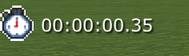
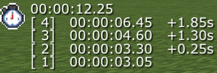
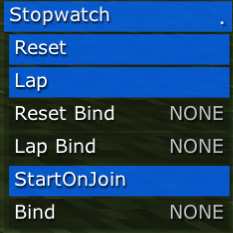
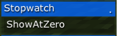

# Icaema's Stopwatch
A stopwatch plugin for RusherHacks inspired by issue [#210](https://github.com/RusherDevelopment/rusherhack-issues/issues/210)

## Features
+ Stopwatch Hud Element

Displays a timer based on client game ticks.

+ Lap Support

Ability to set lap times and have a difference between each one.

+ Stopwatch control module

A ClickGUI Module to control the stopwatch.
When the module is active, the timer will start, and when the module is disabled, it will pause.

+ StartOnJoin

Auto Start the stopwatch when joining a server

+ ShowAtZero

When Disabled, The timer will not show when at zero.

## Installation
To install the plugin into RusherHack, you can follow the instructions on the [RusherHack plugins repository](https://github.com/RusherDevelopment/rusherhack-plugins?tab=readme-ov-file#installation)
